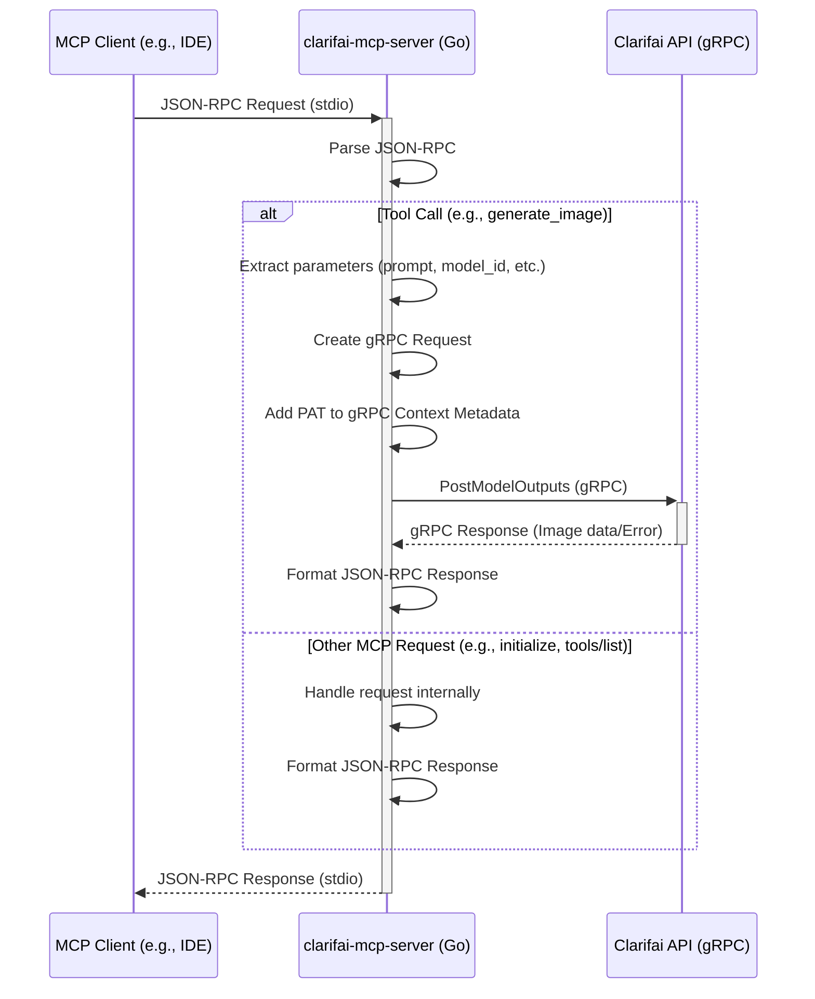

# 🌀 Clarifai MCP Server (Local)

This project provides a Model Context Protocol (MCP) server that acts as a bridge to the Clarifai API. 
It allows MCP clients (like IDE extensions) to interact with Clarifai services, such as image generation and inference, using standard MCP requests.


## Example

For example, given a user prompt, AI agent automatically can call image generation
and places results on Desktop

```txt
Please create 3 txt files with songs on different topics.
The for every text file, generate an image using clarifai by using the song as a description
```


[](https://suno.com/song/3bd22d0f-3d88-4002-b1cc-ca3a3e14bf84?sh=XBiPBEm7hYz2FnBG)[](https://suno.com/song/d4f63bd4-a6cd-45f2-8bc1-0dea9ee7be01?sh=4UF4xlHkAkSbynRm)[](https://suno.com/song/1b9bef83-ed45-466a-b118-0c5481b2b6e9?sh=V0WDqyCzRGPCr4Vh)


## Configuring MCP server

The server is typically run automatically by the MCP client framework (e.g., via settings in VS Code). The configuration usually involves specifying the path to the built binary and any required command-line arguments, such as the Clarifai PAT. You will need Go (version 1.23 or later)

```bash
cd ~
git clone git@github.com:tot-ra/clarifai-mcp-server-local.git
cd clarifai-mcp-server-local
go mod tidy
```

**Build the Binary:**
Use the `go build` command. Specify the output path and target architecture if needed (example for macOS ARM):
```bash
# For macOS ARM
GOOS=darwin GOARCH=arm64 go build -o ./mcp_binary ./...

# For Linux AMD64
# GOOS=linux GOARCH=amd64 go build -o ./mcp_binary ./...

# For Windows AMD64
# GOOS=windows GOARCH=amd64 go build -o ./mcp_binary.exe ./...
```

This will create an executable file named `mcp_binary` (or `mcp_binary.exe` on Windows) in the project's root directory.


Example MCP settings entry (`cline_mcp_settings.json`), for example for Cline:

```json
{
  "mcpServers": {
    "clarifai": {
      "command": "~/clarifai-mcp-server-local/mcp_binary",
      "args": [
        "--pat", "YOUR_CLARIFAI_PAT",
        "--output-path", "~/Desktop/"
      ],
    }
  }
}
```

Replace `YOUR_CLARIFAI_PAT` with your [Clarifai PAT token](https://clarifai.com/settings/security).


## Architecture Overview

The server listens for JSON-RPC requests over standard input/output (stdio). When it receives a request, it translates it into a corresponding gRPC call to the Clarifai API. The response from the Clarifai API is then formatted back into a JSON-RPC response and sent back to the client via stdio.

Authentication is handled via a Personal Access Token (PAT) provided as a command-line argument (`--pat`) when starting the server.

