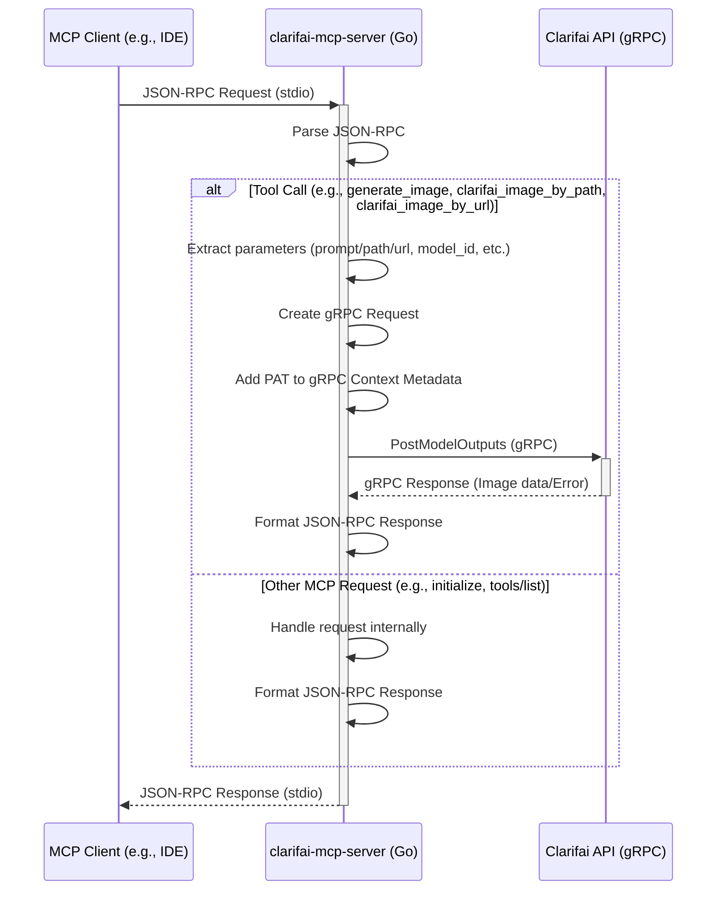

# 🌀 Clarifai MCP Server

This hackday project provides a Model Context Protocol (MCP) server that acts as a bridge to the [Clarifai](https://www.clarifai.com/) API and is meant to run on user's machine (so locally).

It allows MCP clients (like IDE extensions) to interact with Clarifai, such as image generation and inference, using standard MCP requests without overloading LLM context with heavy binary results.


## Example

For example, given a user prompt, AI agent automatically can call image generation
and places results on Desktop


> Please create 3 txt files, write a song about cats (on different topics) in each one of them. 
> Then for every song, generate an image with **Clarifai**


[](https://suno.com/song/3bd22d0f-3d88-4002-b1cc-ca3a3e14bf84?sh=XBiPBEm7hYz2FnBG)[](https://suno.com/song/d4f63bd4-a6cd-45f2-8bc1-0dea9ee7be01?sh=4UF4xlHkAkSbynRm)[](https://suno.com/song/1b9bef83-ed45-466a-b118-0c5481b2b6e9?sh=V0WDqyCzRGPCr4Vh)


## Configuring MCP server for seamless interaction

The server is typically run automatically by the MCP client framework (e.g., via settings in VS Code). The configuration usually involves specifying the path to the built binary and any required command-line arguments, such as the Clarifai PAT. You will need Go (version 1.23 or later)

```bash
cd ~
git clone git@github.com:tot-ra/clarifai-mcp-server-local.git
cd clarifai-mcp-server-local
go mod tidy
```

**Build the Binary:**
Use the `go build` command, targeting the main package within the `cmd/server` directory. Specify the output path and target architecture if needed (example for macOS ARM):
```bash
# For macOS ARM
make build

# For Linux AMD64
# GOOS=linux GOARCH=amd64 go build -o ./mcp_binary ./...

# For Windows AMD64
# GOOS=windows GOARCH=amd64 go build -o ./mcp_binary.exe ./...
```

This will create an executable file named `mcp_binary` (or `mcp_binary.exe` on Windows) in the project's root directory.


Example MCP settings entry (`cline_mcp_settings.json`), for example for Cline:

```json
{
  "mcpServers": {
    "clarifai": {
      "command": "~/clarifai-mcp-server-local/mcp_binary",
      "args": [
        "--pat", "YOUR_CLARIFAI_PAT",
        "--output-path", "~/Desktop/",
        "--default-user-id", "your_user_id",
        "--default-app-id", "your_app_id",
      ],
    }
  }
}
```

Replace `YOUR_CLARIFAI_PAT` with your [Clarifai PAT token](https://clarifai.com/settings/security).


## Testing

Unit tests have been added for several packages. To run all tests, bypass the cache, and see verbose output (including individual test names and status):

```bash
cd clarifai-mcp-server-local
go test -v -count=1 ./...
```

## Features

The server currently exposes the following MCP capabilities:

### Tools

*   **`generate_image`**: Generates an image based on a text prompt using a specified or default Clarifai text-to-image model.
    *   Input: `text_prompt` (required), `model_id`, `user_id`, `app_id` (optional).
    *   Output: Base64 encoded image data (for small images) or a file path (for large images saved to the configured `--output-path`).
*   **`clarifai_image_by_path`**: Performs inference on a local image file using a specified or default Clarifai model.
    *   Input: `filepath` (required, path to the local image), `model_id`, `user_id`, `app_id` (optional).
    *   Output: Text description of inference results (e.g., concepts detected).
*   **`clarifai_image_by_url`**: Performs inference on an image URL using a specified or default Clarifai model.
    *   Input: `image_url` (required), `model_id`, `user_id`, `app_id` (optional).
    *   Output: Text description of inference results (e.g., concepts detected).

### Resources (Read-Only)

The server exposes various Clarifai entities as **read-only** MCP resources, allowing clients to list, search, and read data using standard MCP methods (`resources/list`, `resources/read`). Actions like creating, updating, or deleting entities are handled via MCP **Tools**.

*   **Resource URI Scheme:** Resources follow a consistent URI structure:
    `clarifai://{user_id}/{app_id}/{resource_type}[/{resource_id}][?query_params]`
    Nested resources like model versions or dataset versions follow patterns like:
    `clarifai://{user_id}/{app_id}/models/{model_id}/versions[/{version_id}]`
    `clarifai://{user_id}/{app_id}/datasets/{dataset_id}/versions[/{version_id}]`
    `clarifai://{user_id}/{app_id}/inputs/{input_id}/annotations`

*   **Supported Resource Templates (`resources/templates/list`):** The server provides templates for discovering available resources:
    *   **Inputs:** List, Search, Get
        *   `clarifai://{user_id}/{app_id}/inputs`
        *   `clarifai://{user_id}/{app_id}/inputs?query={search_term}`
        *   `clarifai://{user_id}/{app_id}/inputs/{input_id}`
    *   **Annotations:** List, Search, Get, List by Input
        *   `clarifai://{user_id}/{app_id}/annotations`
        *   `clarifai://{user_id}/{app_id}/annotations?query={search_term}`
        *   `clarifai://{user_id}/{app_id}/annotations/{annotation_id}`
        *   `clarifai://{user_id}/{app_id}/inputs/{input_id}/annotations`
    *   **Models:** List, Search, Get
        *   `clarifai://{user_id}/{app_id}/models`
        *   `clarifai://{user_id}/{app_id}/models?query={search_term}`
        *   `clarifai://{user_id}/{app_id}/models/{model_id}`
    *   **Model Versions:** List, Get
        *   `clarifai://{user_id}/{app_id}/models/{model_id}/versions`
        *   `clarifai://{user_id}/{app_id}/models/{model_id}/versions/{version_id}`
    *   **Datasets:** List, Get
        *   `clarifai://{user_id}/{app_id}/datasets`
        *   `clarifai://{user_id}/{app_id}/datasets/{dataset_id}`
    *   **Dataset Versions:** List (Reading specific versions not yet implemented)
        *   `clarifai://{user_id}/{app_id}/datasets/{dataset_id}/versions`

*   **Listing (`resources/list`):**
    *   Use a template URI (e.g., `clarifai://.../inputs`) to list resources of that type. Supports pagination via the `cursor` parameter (representing the page number).
    *   Use a search template URI (e.g., `clarifai://.../inputs?query=cats`) to search resources.
    *   If called without a URI, it defaults to listing inputs in the context defined by `--default-user-id` and `--default-app-id` flags (if set).

*   **Reading (`resources/read`):**
    *   Use a specific resource URI (e.g., `clarifai://.../models/{model_id}`) to retrieve the full details of the corresponding Clarifai object (Input, Model, Annotation, etc.).
    *   The result is returned as a JSON string in the `text` field of the resource content.

## Architecture Overview

The server listens for JSON-RPC requests over standard input/output (stdio), parses them, and routes them to the appropriate tool handler (`generate_image`, `clarifai_image_by_path`, or `clarifai_image_by_url`). The handler constructs a gRPC request, adds authentication using the provided PAT, and calls the Clarifai API. The response from the Clarifai API is then formatted back into a JSON-RPC response and sent back to the client via stdio. Large image results can optionally be saved to disk instead of being sent back directly.

The codebase is structured into several packages:
- `cmd/server`: Main application entry point.
- `internal/config`: Configuration loading (flags).
- `internal/mcp`: JSON-RPC request/response handling over stdio.
- `internal/clarifai`: gRPC client setup and API interaction helpers.
- `internal/tools`: Implementation of the MCP tools (`generate_image`, `clarifai_image_by_path`, `clarifai_image_by_url`).
- `internal/utils`: Filesystem utilities (e.g., saving images).

Authentication is handled via a Personal Access Token (PAT) provided as a required command-line argument (`--pat`) when starting the server.


